# RaspberryPi GPIO
## Inleiding

De Raspberry PI is een kleine single bord computer. De Raspberry Pi werd ontwikkeld aan de Universiteit van Cambridge en was bedoeld voor educatieve doeleinden. De productie van de eerste Raspberry Pi model B werd op 10 januari 2012 gestart. Sindsdien zijn er verschillende modellen en versies uitgebracht.

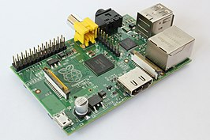

De aanwezigheid van de General Purpose Input/output pinnen maakt het mogelijk om zelf sensoren en acutator aan te sluiten op de raspberry pi. Eveneens zijn er heel wat addon-board beschikbaar.

## Verschillende modellen

Na de introductie in 2012 zijn er nog verschillende modellen ontwikkeld.

Raspberry pi Model A uit 2012 zonder netwerkaansluiting.

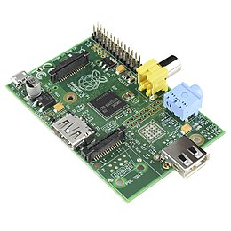

Raspberry pi B+ uit 2014 met o.a. micro SD-kaart in plaats van SD kaart.


Raspberry pi 3B uit 2018 met o.a. snellere 1,4 GHz processor, gigiabit ethernet aansluiting en dual band wifi.

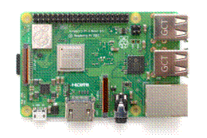

Raspberry pi 4B uit 2019 met o.a. snellere 1,5 GHz processor, USB 3.0. De Raspberry pi 4B is beschikbaar in versies met 2, 4 of 8 GB RAM-geheugen.


De recentste versies van de raspberry pi beschikken onder andere over:

* Voldoende USB poorten voor toetsenbord, muis en extra randapparaten.
* 40 pins connector voor General Purpose Input/output (GPIO)
* 1 GB LAN aansluiting
* WIFI
* Bluetooth
*  ….

In deze cursus wordt gebruik gemaakt van de Raspberry pi 4B.

## Raspberry pi besturingssystemen
 
Er zijn verschillende besturingssystemen beschikbaar als image voor de raspberry pi. Momenteel is het meest gebruikte Raspbian, wat in deze cursus gebruikt wordt.
Andere besturingssystemen zijn onder andere Ubuntu Mate, Windows 10 IOT core, Risc OS, …

## Aanmaken bootable SD-kaart en opstarten Raspberry Pi

Er moet een bootable micro SD-kaart aangemaakt worden waar het besturingssysteem op staat. Download hiervoor volgende software en installeer deze.
[https://www.raspberrypi.org/software/](https://www.raspberrypi.org/software/)

Start de software 

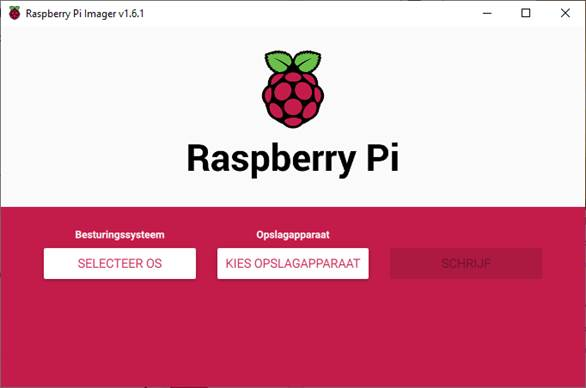

Kies Raspberry Pi OS (32-bit) of een ander OS.

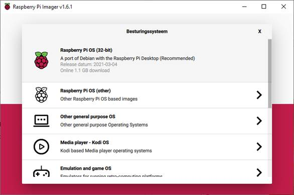

Kies als opslagapparaat de micro SD-card voor de raspberry pi.

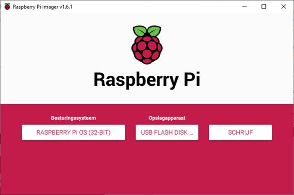

Klik op SCHRIJF en vervolgens op JA

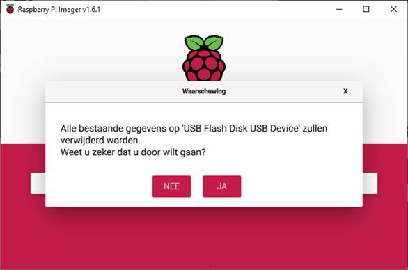

Plaats de micro SD-card in de raspberry pi en start op.

## Opstarten

Na het aansluiten van een toetsenbord, muis, voeding en een scherm via HDMI of micro HDMI aansluiting (Rapsberry Pi 4) krijg je een grafische omgeving.
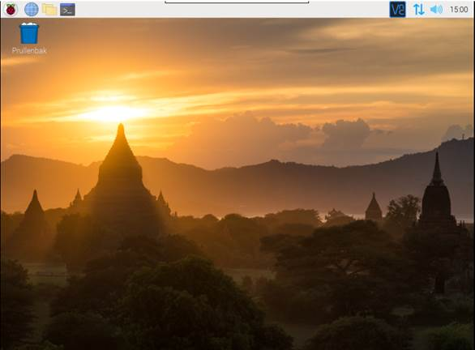

Vervolgens moet het land, de taal en de tijdszone ingesteld worden.
De standaard gebruiker is pi en het paswoord raspberry. Het is echter aan te raden dit paswoord aan te passen.
Eveneens kan er een verbinding gemaakt worden met het wifi netwerk.
Als laatste stap wordt gevraagd om de software te updaten. Dit zal even duren. Neem gerust terug een kop koffie.
## Raspberry pi vanop afstand bedienen

Om de raspberry pi vanop afstand via de grafische interface te bedienen kan gebruikt gemaakt worden van VNC. VNC moet gedownload worden op de computer die gebruikt wordt voor de externe toegang. [VNC Viewer](https://www.realvnc.com/en/connect/download/viewer/)

Op de raspberry pi moet de toegang via VNC ingesteld worden. 

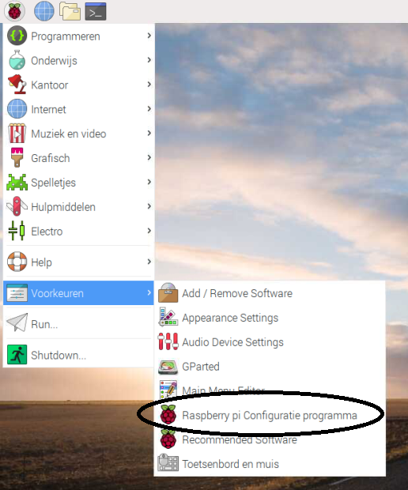

Schakel vervolgens VNC in.

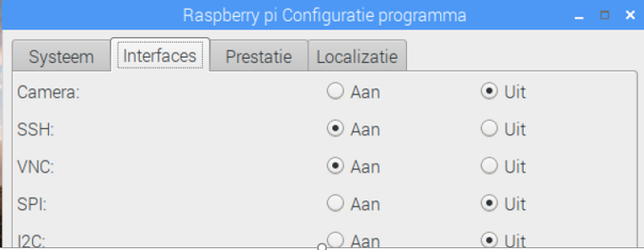

Start de Raspberry Pi opnieuw op en zoek het IP-adres op via LXTernminal.

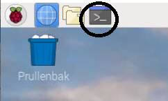

Type de instructie ifconfig in de LXTerminal

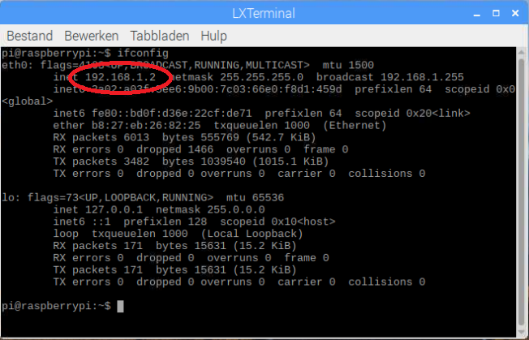

Het IP-adres wordt weergegeven. Noteer of onthoud het IP-adres van de raspberry pi.

Geef het IP-adres in VNC-Viewer.

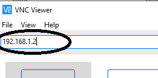

De Raspberry Pi kan nu vanop afstand bediend worden. 
Indien je een zwart scherm krijgt in VNC-Viewer moet je de resolutie van de raspberry pi aanpassen.

## GPIO Zero

GPIO Zero is een Python-bibliotheek die het relatief eenvoudig maakt sensoren en actuatoren aan te sluiten op de raspberry pi via de GPIO pinnen.

## Inschakelen GPIO pinnen

Kies “Voorkeuren” en vervolgens “Raspberry pi Configuratie programma”

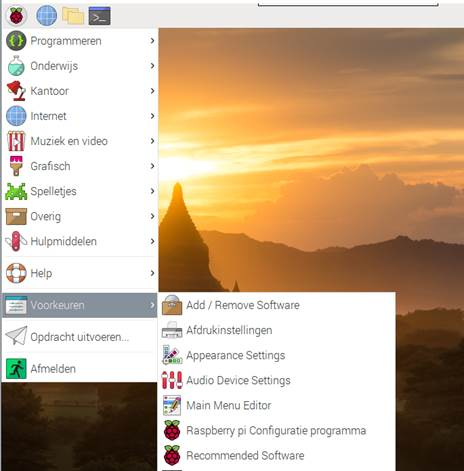

Schakel in het “Raspberry pi Configuratie programma” op het tabblad “Interfaces” de nodige GPIO-communicatie in.

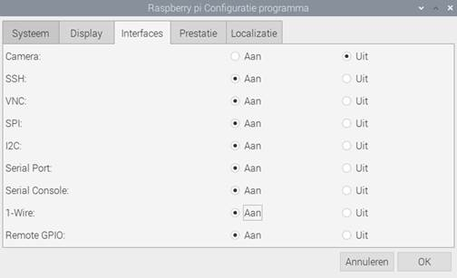

## Pin lay-out GPIO raspberry pi 

De GPIO pinnen van de raspberry pi

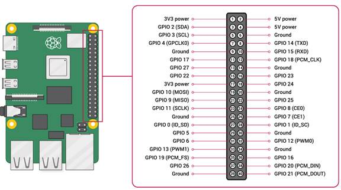

## Python 3

Zorg dat je gebruik maakt van python 3. Dit kan je controleren via volgende commando in een terminal venster.

```cpp
python --version
```
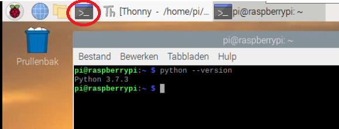

Indien je niet over versie 3 beschikt is een update mogelijk door de instellingen aan te passen in het bashrc bestand. In het voorbeeld wordt gebruik gemaakt van de editor nano.

```cpp
nano ~/.bashrc
```
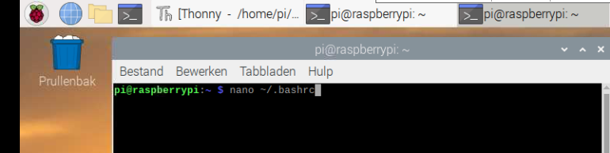

Voeg onderaan in het bashrc bestand volgende regels code toe zodat python 3 gebruikt wordt en pip3.

```cpp
alias python='/usr/bin/python3'
alias pip=pip3
```
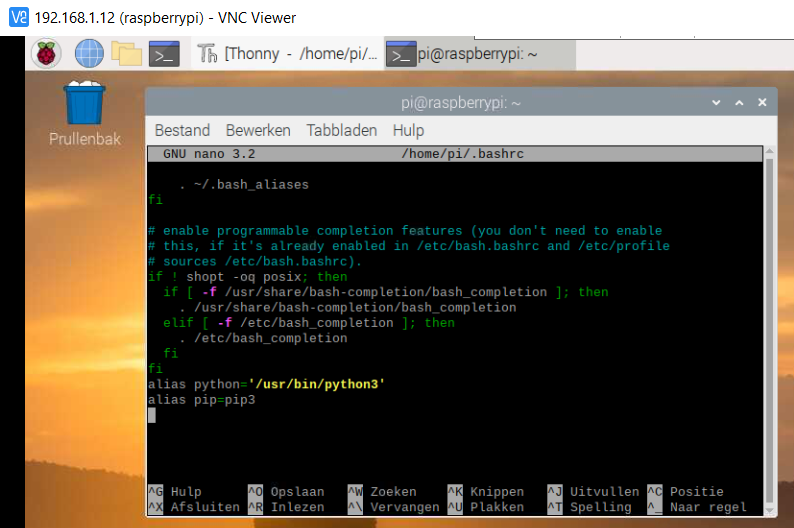

Bewaar de aanpassingen met de toetsencombinatie Ctrl + O.
Sluit nano met de toestencombinatie Ctrl + X.

Voer de volgende instructie uit:

```cpp
source ~/.bashrc
```

Controller terug de python versie met volgende commando in het terminal venster:

```cpp
python --version
```

## gpiozero library

Installeer indien nodig de bibliotheek gpiozero door in een terminal venster volgend instructie in te geven:

```cpp
sudo apt install python3-gpiozero
```
 
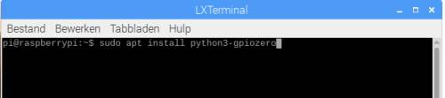

## Code editor

Een goede beginners editor voor python op raspberry pi in Thonny Python IDE.

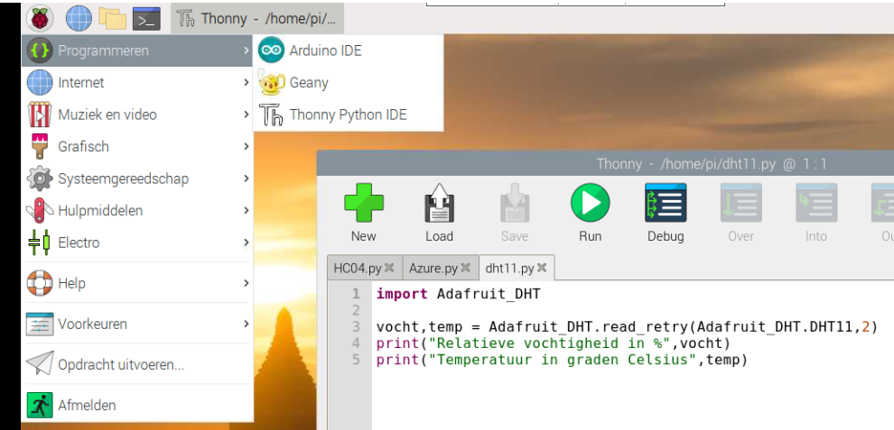


## led oplichten

Test volgende python script op de raspberry pi
 
```py
import gpiozero as io

led = io.LED(18)
led.on()
```
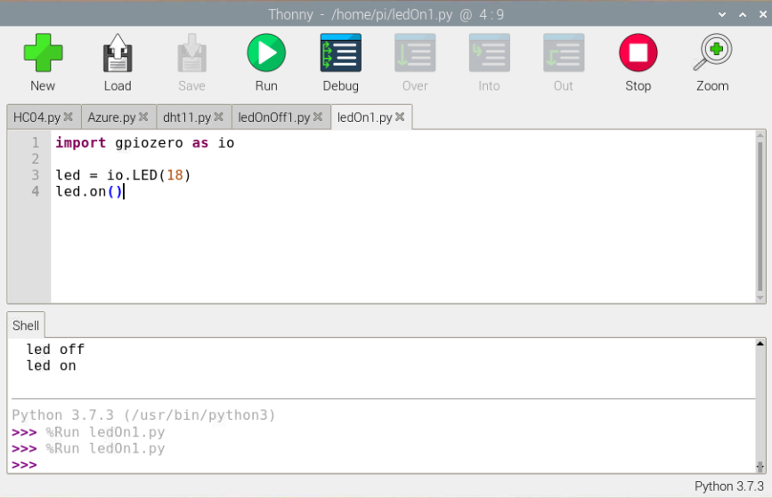
In het voorbeeld maken we gebruik van de bibliotheek gpiozero. De functie LED zit in deze bibliotheek.
Op de 2de regel wordt het object led aangemaakt en wordt de pin 18 toegewezen.
Op de 3de regel wordt met de methode on() de led ingeschakeld. 

Oefening:

* Laat 2 leds oplichten. Kies zelf een GPIO pin voor de 2de led.

## Leds knipperen

Test volgende python script op de raspberry pi

```py
from time import sleep
import gpiozero as io

led = io.LED(18)

while True:
    led.on()
    sleep(1)
    led.off()
    sleep(1)
```

Uitleg:

* Importeer uit de library time de functie sleep.
* Importeer de library gpiozero en wijs deze toe aan de klasse io.
* Maak het object led aan en wijs de pin 18 toe.
* Met de methode .on() wordt de led ingeschakeld en met .off() wordt de led uitgeschakeld.
* Sleep (1) Pauzeer de uitvoering van het script gedurende 1 seconde.

Onderzoek: geef met de functie print de toestand van led weer voor het inschakelen en na het inschakelen.

Oefening:

* Laat 2 externe leds afwisselend knipperen.

## Digitale ingang inlezen

Met volgende schakeling is het mogelijk een logische “1” en “0” te produceren aan een ingang van de raspberry pi.

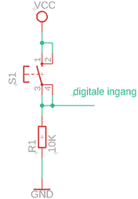 
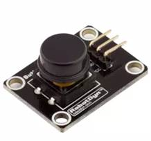

Test volgende programma uit.

```py
# Button op GPIO04
import gpiozero as io
from time import sleep

knop = io.Button(4)

while True:
    sleep (0.1)
    if knop.value==1:
        print ("Knop niet ingedrukt")
    else:
        print ("Knop ingedrukt")
```
Onderzoek: geef met de functie print de toestand van knop.value weer. Wat stel je vast?


Oefeningen:

* Laat een led oplichten wanneer een drukknop ingedrukt is.
* Voorzie een drukknop voor de led in te schakelen en een drukknop om de led uit te schakelen. 


## DHT 11 temperatuur- en luchtvochtigheidssensor

De DHT11 is een temperatuur- en luchtvochtigheidssensor. 

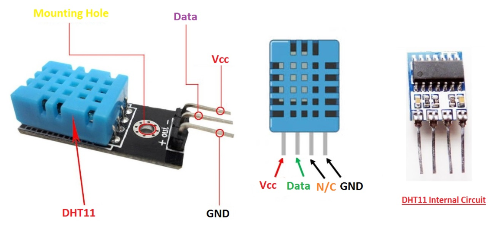

De DHT11 is zowel in 3 pins aansluiting als 4 pins aansluiting beschikbaar. Daarnaast beschillen sommige bordjes al over een interne pull-up weerstand.

Doordat de uitgang van de DHT een opendrain of opencollector uitgang bezit is een pull-up weerstand nodig. Indien de pull-up weerstand niet aanwezig is zou een zwevend signaal ontstaan wanneer de transistor niet in geleiding is.

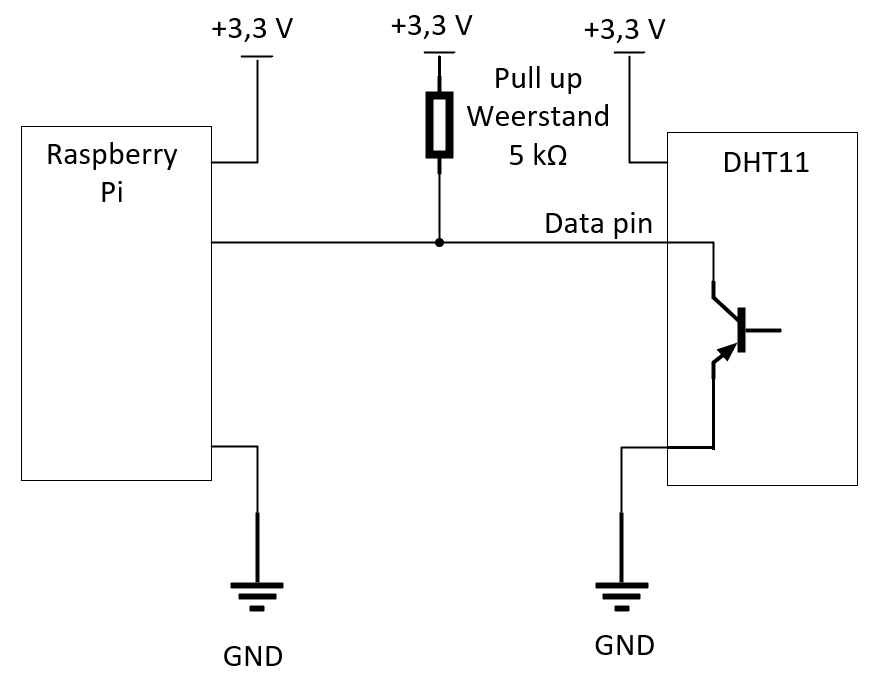

Installeer de bijhorende bibliotheek in cd command line.
 
```
sudo pip3 install Adafruit_python_DHT
```


Voorbeeldcode:

 
```py
import Adafruit_DHT

vocht,temp = Adafruit_DHT.read_retry(Adafruit_DHT.DHT11,2)
print("Relatieve vochtigheid in %",vocht)
print("Temperatuur in graden Celsius",temp)
```

## Componentenlijst

Alle componenten zij normaal eenvoudig te verkrijgen bij verschillende leveranciers. In onderstaande lijst worden de link naar opencircuit.nl en bol.com opgenomen.

| Aantal | Omschrijving en link |
| ------------- |-------------|
| 1 | [Raspberry pi 4 2GB](https://opencircuit.nl/Product/Raspberry-Pi-4-Model-B-2GB) |
| 1 | [Micro SD card 16 GB via Bol.com](https://www.bol.com/nl/p/sandisk-ultra-micro-sdhc-16gb-met-adapter/9200000047488161/?bltg=itm_event%3Dclick%26mmt_id%3DXpypfxzFJtmxY97Bt%40ASJgAAAkU%26slt_type%3Drecommendations%26pg_nm%3Dpdp%26slt_id%3Dprd_reco%26slt_nm%3Dproduct_recommendations%26slt_pos%3DC1%26slt_owner%3Dccs%26itm_type%3Dproduct%26itm_lp%3D7%26itm_id%3D9200000047488161&bltgh=pzBqWqrgRYsqySSU7HlKMw.1_7_8.15.ProductTitle) | 
| 1 | [Voeding voor Raspberry pi 4](https://opencircuit.nl/Product/Raspberry-Pi-4-voeding-USB-C.-5.1V.-3A-EU-Plug) |
| 1 | [Micro HDMI kabel](https://opencircuit.nl/Product/Offici%C3%ABle-Micro-HDMI-naar-HDMI-kabel-1-m) |
| 1 | [Breadboard](https://opencircuit.nl/Product/Breadboard-wit-400-punten) |
| 1 | [DHT11 tempeatuur- en luchtvochtigheidssensor](https://opencircuit.nl/Product/DHT11-Luchtvochtigheid-temperatuur-sensor) |


[](https://app.netlify.com/sites/innovet-raspberrypigpio/deploys)
 